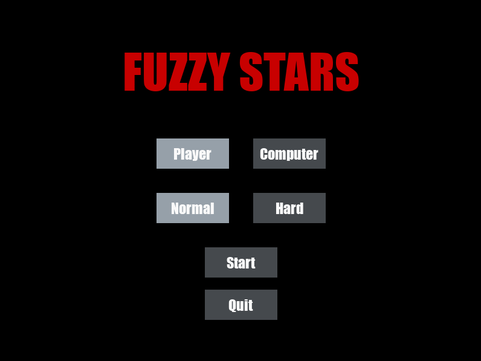

# Fuzzy Stars

Fuzzy Stars is a game written in Python using PyGame library. You can control a ship yourself or let computer do it for you using fuzzy logic (skfuzzy library). Main goal is to avoid ships flying in the opposite direction.



## Launch

Needed libraries:

- pygame
- skfuzzy
- numpy 

To run game type:

```bash
python main.py
```
